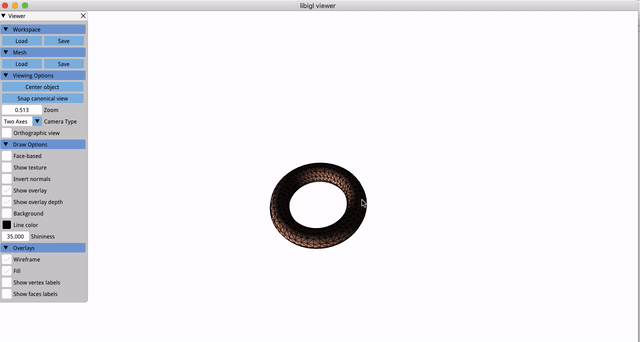
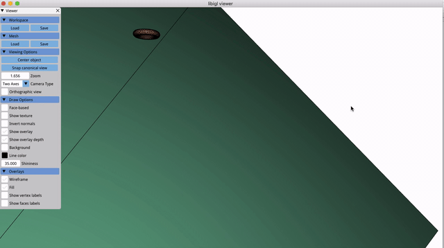

# Some Graphics Results From My CSC418 & CSC2549 Assignments
All assignments are done by C++ or GLSL

## 3D Mass Spring Bunny, Linearly Implicit Euler

## Skinned 3D FEM Bunny, Linearly Implicit Euler

## FEM Cloth Simulation, Simple Collision

## Rigid Body Simulation

## Rigid Body Collision

## Earth Simulation

