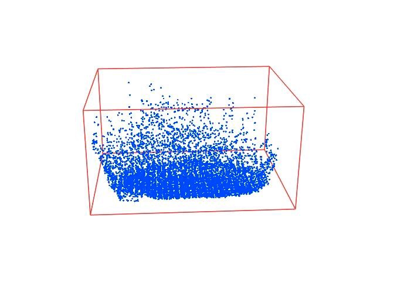

## Fluid Simulation

## Implemented
* 3D Mac grid
* Semi-Lagrangian advection algorithmd
* Marker particle visualization
* Using pressure solver from Bridson and Müller-Fischer


## TODO
* Make it faaster and prettier and more interactive!!
* Other advection algorithm
* Level set and Signed distance 
* A fluid bunny
* Curved solid boudary (other weird collision)
* Marching Cube 

## To Run
```bash
mkdir build
cd build
cmake .. -DCMAKE_BUILD_TYPE=Release
make 
./fluid
```

